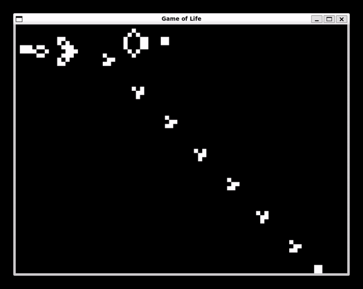

<a name="readme-top"></a>

<h1 align="center">
  <br>
    
  <br>
</h1>

<h1 align="center">Game of Life</h1>

<p align="center">
  <a href="https://gcc.gnu.org"></a>
  <a href="https://www.libsdl.org"></a>
</p>

<p align="center">
  <a href="#description">Description</a> •
  <a href="#getting-started">Getting Started</a> •
  <a href="#controls">Controls</a> •
  <a href="#patterns">Patterns</a> •
  <a href="#project-structure">Project Structure</a> •
  <a href="#contribution">Contribution</a> •
  <a href="#license">License</a>
</p>




## Description

The Game of Life is a cellular automaton devised by the British mathematician John Horton Conway in 1970. It's a zero-player game that simulates the life cycle of cells on a grid based on initial configurations.

## Getting Started

### Prerequisites

- GCC (GNU Compiler Collection)
- SDL2 library
  - `sudo apt install libsdl2-dev`
  - `sudo apt install libsdl2-ttf-dev`

### Compilation

To compile the game, run the provided bash script `build.sh`:

```sh
chmod +x build.sh
./build.sh
```

The original commande to complie a file is_

```sh
gcc -Wall -g -o EXE_NAME FILE_NAME.c -lSDL2
```

### Running the Game

Execute the binary to run the game:

```sh
./game_of_life
```

## Controls

Use these keys to interact with the game:

- `h`: Spawn a Glider.
- `g`: Spawn a Gosper Glider Gun.
- `p`: Spawn a Pulsar.
- `m`: Spawn a Hammerhead
- `c`: Clear the grid.
- `ESC`: Quit the game.

## Patterns

The game includes various predefined patterns such as Glider and Gosper Glider Gun, which have unique behaviors within the Game of Life.

## Project Structure

The project includes source files (`src/`), headers (`inc/`), the build script, and this README.

## Contribution

Contributions to the Game of Life project are welcome. Feel free to fork, make changes, and submit a pull request.

## License

This project is open source and available under the [MIT License](LICENSE).

<p align="right">(<a href="#readme-top">Back to top</a>)</p>

---

> GitHub [@AlecInfo](https://github.com/AlecInfo) &nbsp;&middot;&nbsp;<a name="readme-top"></a>

<h1 align="center">
  <br>
    
  <br>
</h1>

<h1 align="center">Game of Life</h1>

<p align="center">
  <a href="https://gcc.gnu.org"></a>
  <a href="https://www.libsdl.org"></a>
</p>

<p align="center">
  <a href="#description">Description</a> •
  <a href="#getting-started">Getting Started</a> •
  <a href="#controls">Controls</a> •
  <a href="#patterns">Patterns</a> •
  <a href="#project-structure">Project Structure</a> •
  <a href="#contribution">Contribution</a> •
  <a href="#license">License</a>
</p>


## Description

The Game of Life is a cellular automaton devised by the British mathematician John Horton Conway in 1970. It's a zero-player game that simulates the life cycle of cells on a grid based on initial configurations.

## Getting Started

### Prerequisites

- GCC (GNU Compiler Collection)
- SDL2 library
  - `sudo apt install libsdl2-dev`
  - `sudo apt install libsdl2-ttf-dev`

### Compilation

To compile the game, run the provided bash script `build.sh`:

```sh
chmod +x build.sh
./build.sh
```

The original commande to complie a file is_

```sh
gcc -Wall -g -o EXE_NAME FILE_NAME.c -lSDL2
```

### Running the Game

Execute the binary to run the game:

```sh
./game_of_life
```

## Controls

Use these keys to interact with the game:

- `h`: Spawn a Glider.
- `g`: Spawn a Gosper Glider Gun.
- `p`: Spawn a Pulsar.
- `m`: Spawn a Hammerhead
- `c`: Clear the grid.
- `ESC`: Quit the game.

## Patterns

The game includes various predefined patterns such as Glider and Gosper Glider Gun, which have unique behaviors within the Game of Life.

## Project Structure

The project includes source files (`src/`), headers (`inc/`), the build script, and this README.

## Contribution

Contributions to the Game of Life project are welcome. Feel free to fork, make changes, and submit a pull request.

## License

This project is open source and available under the [MIT License](LICENSE).

<p align="right">(<a href="#readme-top">Back to top</a>)</p>

---

> GitHub [@AlecInfo](https://github.com/AlecInfo) &nbsp;&middot;&nbsp;